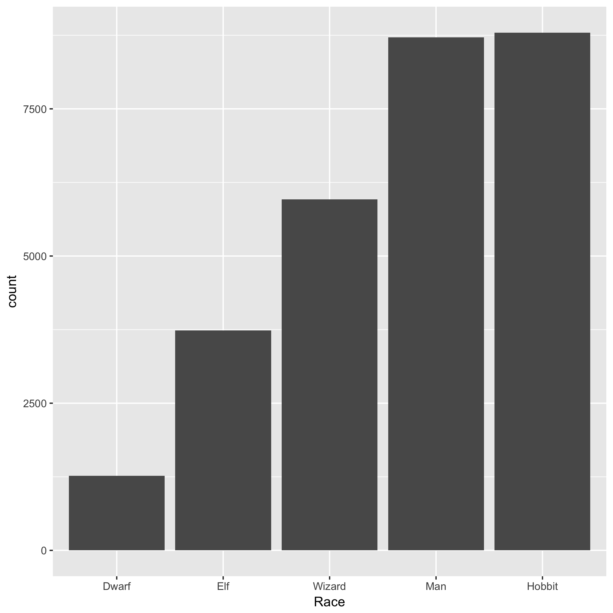
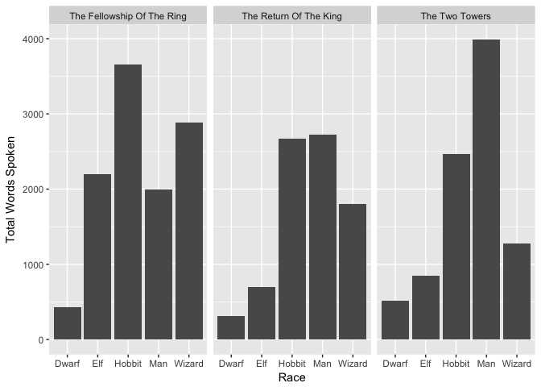
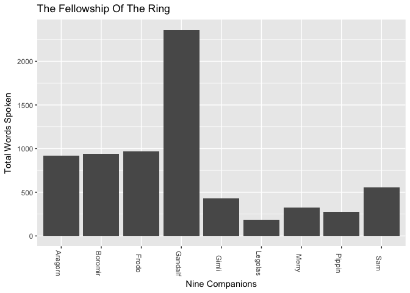
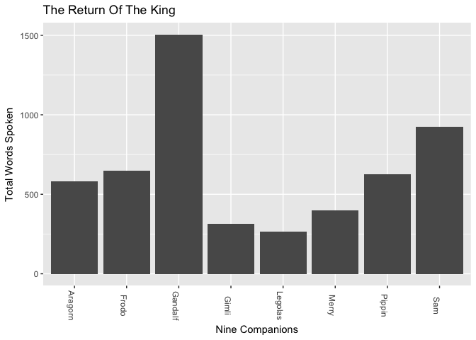
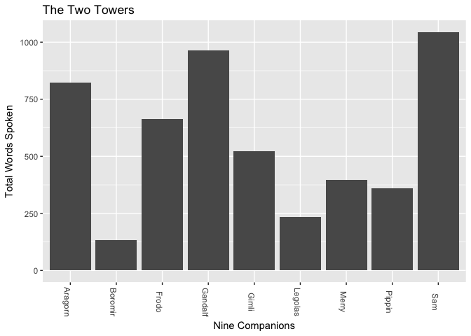

---
output:
  html_document:
    keep_md: yes
---
LOTR R Markdown file
========================================================

This R Markdown file presents the original data, the statistical summaries and all figures generated.

# Data Tidying and Preliminary Analysis

Load libraries


```r
library(ggplot2)
library(dplyr)
```

```
## Warning: package 'dplyr' was built under R version 3.4.2
```

```
## 
## Attaching package: 'dplyr'
```

```
## The following objects are masked from 'package:stats':
## 
##     filter, lag
```

```
## The following objects are masked from 'package:base':
## 
##     intersect, setdiff, setequal, union
```

```r
library(stringr)
```

Import data


```r
lotr_data <- read.delim("lotr_raw.tsv")
glimpse(lotr_data)
```

```
## Observations: 731
## Variables: 5
## $ Film      <fctr> The Fellowship Of The Ring, The Fellowship Of The R...
## $ Chapter   <fctr> 01: Prologue, 01: Prologue, 01: Prologue, 01: Prolo...
## $ Character <fctr> Bilbo, Elrond, Galadriel, Gollum, Bilbo, Bilbo, Fro...
## $ Race      <fctr> Hobbit, Elf, Elf, Gollum, Hobbit, Hobbit, Hobbit, A...
## $ Words     <int> 4, 5, 460, 20, 214, 70, 128, 197, 10, 12, 339, 64, 8...
```

Make Chapter column into two columns (number and name) and rename columns after binding together


```r
lotr_data_split <- data.frame(do.call(rbind, strsplit(as.vector(lotr_data$Chapter), split = ":")))
names(lotr_data_split) <- c("Chapter_Number", "Chapter_Name")
lotr_data_clean_split <- cbind(lotr_data$Film, lotr_data_split, lotr_data$Character, lotr_data$Race, lotr_data$Words)
ldcs2<- plyr::rename(lotr_data_clean_split, c("lotr_data$Film"="Film", "lotr_data$Character"="Character", "lotr_data$Race"="Race", "lotr_data$Words"="Words"))
```

Reorder Film factor levels


```r
old_levels <- levels(ldcs2$Film)
j_order <- sapply(c("Fellowship", "Towers", "Return"),
				  function(x) grep(x, old_levels))
new_levels <- old_levels[j_order]
```

Clean up dataset: apply new factor levels to Film, change name of races, drop less frequent races, arrange based on race,film, words


```r
lotr_data_clean <- ldcs2 %>% 
	mutate("Film" = factor(as.character(Film), new_levels),
		   "Race" = plyr::revalue(Race, c(Ainur="Wizard", Men="Man"))) %>% 
	filter(!(Race %in% c("Gollum", "Orc", "Ent", "Dead", "Nazgul"))) %>% 
	mutate(Race = reorder(Race, Words, sum)) %>% 
	arrange(Race,Film, Character, Words) %>% 
	droplevels
glimpse(lotr_data_clean)
```

```
## Observations: 653
## Variables: 6
## $ Film           <fctr> The Fellowship Of The Ring, The Fellowship Of ...
## $ Chapter_Number <fctr> 34, 36, 46, 32, 35, 27, 31, 43, 33, 41, 37, 35...
## $ Chapter_Name   <fctr>  A Journey In The Dark,  The Bridge Of Khazad-...
## $ Character      <fctr> Gimli, Gimli, Gimli, Gimli, Gimli, Gimli, Giml...
## $ Race           <fctr> Dwarf, Dwarf, Dwarf, Dwarf, Dwarf, Dwarf, Dwar...
## $ Words          <int> 6, 7, 12, 19, 37, 38, 47, 48, 52, 81, 84, 4, 5,...
```

Import our clean dataset

```r
lotr_data_clean <- read.delim("lotr_clean.tsv")
```

Here is a plot I embedded about which race does the most talking in the films


Here are plots that show words spoken by races, facetted by film


```r
plot1 <- lotr_data_clean %>% 
	ggplot(aes(Race, Words)) + 
	geom_col() +
	facet_wrap(~Film) +
	labs(y="Total Words Spoken") 
print(plot1)
```

<!-- -->

# The Nine Companions

Filter to show total words spoken by the Nine Companions


```r
fellowship <- c("Gandalf", "Aragorn", "Merry", "Pippin", "Frodo", "Sam", "Gimli", "Legolas", "Boromir")
(characterwords <- lotr_data %>% 
	filter(Character %in% fellowship) %>% 
	group_by(Character, Film) %>% 
	summarize(sum(Words)))
```

```
## # A tibble: 26 x 3
## # Groups:   Character [?]
##    Character                       Film `sum(Words)`
##       <fctr>                     <fctr>        <int>
##  1   Aragorn The Fellowship Of The Ring          920
##  2   Aragorn     The Return Of The King          580
##  3   Aragorn             The Two Towers          822
##  4   Boromir The Fellowship Of The Ring          943
##  5   Boromir             The Two Towers          134
##  6     Frodo The Fellowship Of The Ring          967
##  7     Frodo     The Return Of The King          650
##  8     Frodo             The Two Towers          664
##  9   Gandalf The Fellowship Of The Ring         2360
## 10   Gandalf     The Return Of The King         1504
## # ... with 16 more rows
```

For each Film, show a plot of words by fellowship member


```r
plyr::d_ply(characterwords, ~Film, function(p){
	the_film <- p$Film[1]
	R <- ggplot(p, aes(Character, `sum(Words)`))+ 
		geom_col() +
		theme(axis.text.x=element_text (angle=270)) +
		labs(y="Total Words Spoken", x= "Nine Companions")+
		ggtitle(the_film)
	print(R)
})
```

<!-- --><!-- --><!-- -->


