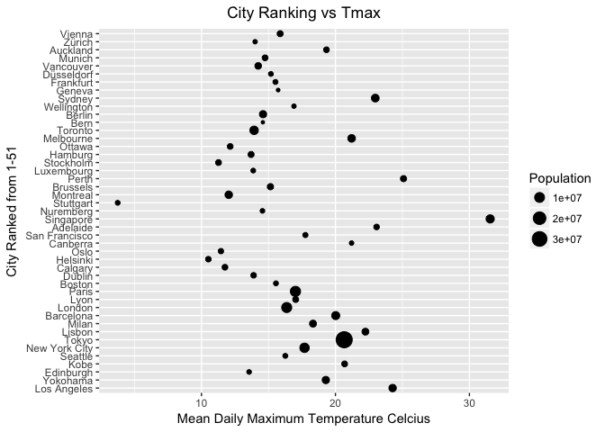
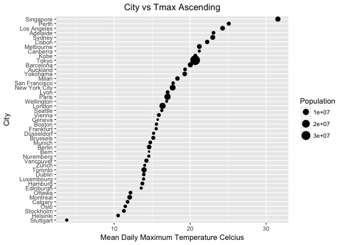
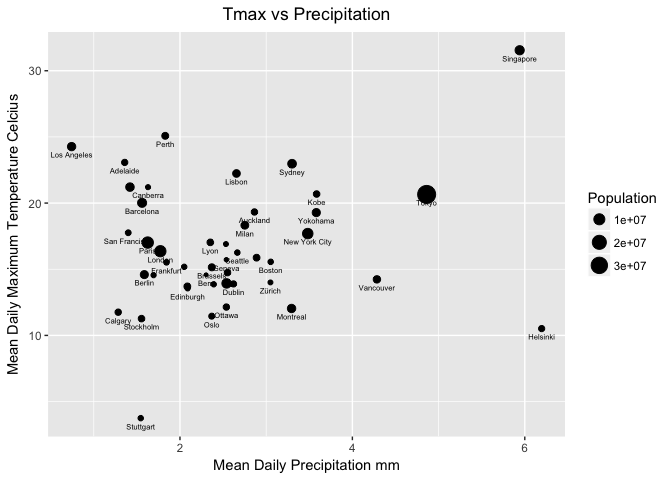
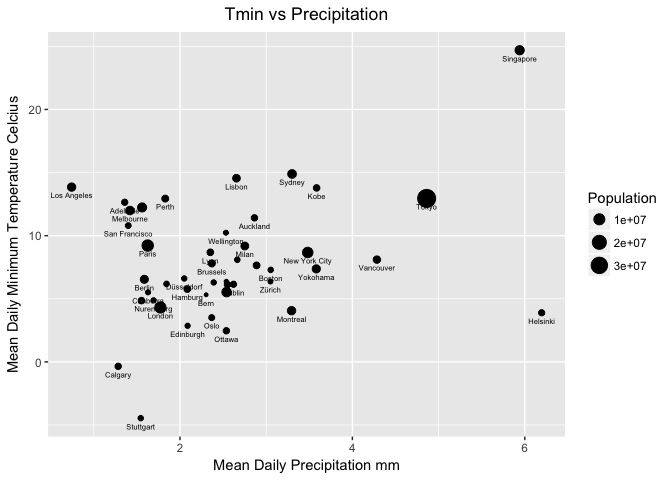
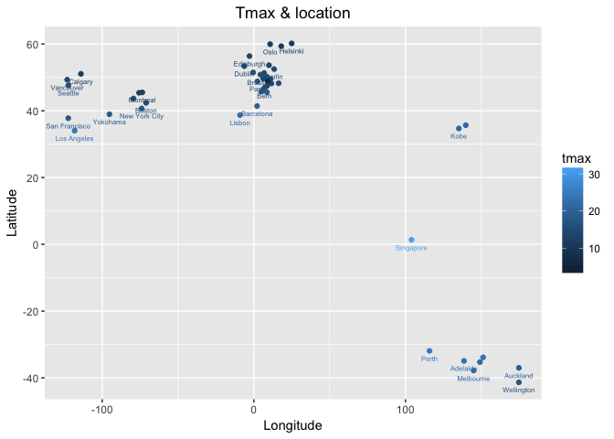

Based on the data we have assembled using webscraping (with `rvest`) and APIs let's analyze it to look at the findings of weather, temperture, location and ranking

Let's start with loading the dataframe and looking at few factors

***
## 1. City Ranking, Temperature and Precipitation


```r
citydata<- read_csv("finalcitydata.csv")
```

```
## Parsed with column specification:
## cols(
##   `Quality of Living Ranking` = col_integer(),
##   City = col_character(),
##   Country = col_character(),
##   Population = col_double(),
##   id = col_character(),
##   longitude = col_double(),
##   latitude = col_double(),
##   prcp = col_double(),
##   tmax = col_double(),
##   tmin = col_double()
## )
```

```r
citydata2= na.omit(citydata)
citydata2 %>% 
  ggplot(aes(x=tmax, y=fct_reorder(City, `Quality of Living Ranking`, max, .desc=TRUE), size = Population)) + 
  geom_point() +
  labs(y="City Ranked from 1-51", x="Mean Daily Maximum Temperature Celcius", title="City Ranking vs Tmax") +
  theme(plot.title = element_text(hjust = 0.5))
```

<!-- -->

```r
citydata2 %>% 
  ggplot(aes(x=tmax, y=fct_reorder(City, tmax, max), size = Population)) + 
  geom_point() +
  labs(y="City", x="Mean Daily Maximum Temperature Celcius", title="City vs Tmax Ascending") +
  theme(plot.title = element_text(hjust = 0.5))
```

<!-- -->

Quality of Living Ranking vs TMax-We can see no discernable pattern although it seems higher ranked cities have smaller populations
Reoder City vs Tmax- We can see the tmax for the top ranked cities varies from 5< to 30> degrees Celcius

Let's also do the same analysis for Precipation Data


```r
citydata2 %>% 
  ggplot(aes(x=prcp, y=fct_reorder(City, `Quality of Living Ranking`, max, .desc=TRUE), size = Population)) + 
  geom_point() +
  labs(y="City Ranked from 1-51", x="Mean Daily Precipitation mm", title="City Ranking vs Precipitation") +
  theme(plot.title = element_text(hjust = 0.5))
```

<!-- -->

```r
citydata2 %>% 
  ggplot(aes(x=prcp, y=fct_reorder(City, prcp, max), size = Population)) + 
  geom_point() +
  labs(y="City", x="Mean Daily Precipitation mm", title="City vs Precipitation Ascending") +
  theme(plot.title = element_text(hjust = 0.5)) 
```

<!-- -->

Conclusions:
Quality of Living Ranking vs Precipitation-We can see no discernable pattern although it seems higher ranked cities have smaller populations and less precipitation
Reoder City vs Precipitation- We can see the precipitation for the top ranked cities varies from 1< to 6> mm

***
## 2. Precipitation vs Temperature


```r
citydata2 %>% 
  ggplot(aes(x=prcp, y=tmax, size = Population, label=City)) + 
  geom_point() +
  labs(y="Mean Daily Maximum Temperature Celcius", x="Mean Daily Precipitation mm", title="Tmax vs Precipitation") +
  theme(plot.title = element_text(hjust = 0.5)) +
   geom_text(hjust = 0.5, size = 2, vjust=2, check_overlap=TRUE) 
```

<!-- -->

```r
citydata2 %>% 
  ggplot(aes(x=prcp, y=tmin, size = Population, label=City)) + 
  geom_point() +
  labs(y="Mean Daily Minimum Temperature Celcius", x="Mean Daily Precipitation mm", title="Tmin vs Precipitation") +
  theme(plot.title = element_text(hjust = 0.5)) +
   geom_text(hjust = 0.5, size = 2, vjust=2, check_overlap=TRUE)
```

<!-- -->

Conclusions:
From the plots above we can see that generally, the top 51 ranked cities in the world generally have daily precipitation less than 4 mm.  They are much more dissimilar and have greater ranges in their tmin and tmax.

***
## 3. Latitude and Longitude & Temperature

Lastly let's look at Lat/Lon and how it might relate to temperature


```r
citydata2 %>% 
  ggplot(aes(x=longitude, y=latitude, colour = tmin, label=City)) + 
  geom_point() +
  labs(y="Latitude", x="Longitude", title="Tmin & location") +
  theme(plot.title = element_text(hjust = 0.5)) +
   geom_text(hjust = 0.5, size = 2, vjust=2, check_overlap=TRUE) 
```

<!-- -->

```r
citydata2 %>% 
  ggplot(aes(x=longitude, y=latitude, colour = tmax, label=City)) + 
  geom_point() +
  labs(y="Latitude", x="Longitude", title="Tmax & location") +
  theme(plot.title = element_text(hjust = 0.5)) +
   geom_text(hjust = 0.5, size = 2, vjust=2, check_overlap=TRUE) 
```

<!-- -->

Conclusions:
What we can see from the two plots is mostly inconclusive given so few data points.  Overall, however, we can observe that cities at higher latitude are generally cooler (lower tmax and lower tmin) and that cities closer to the equator (latitude = 0) are generally warmer.
